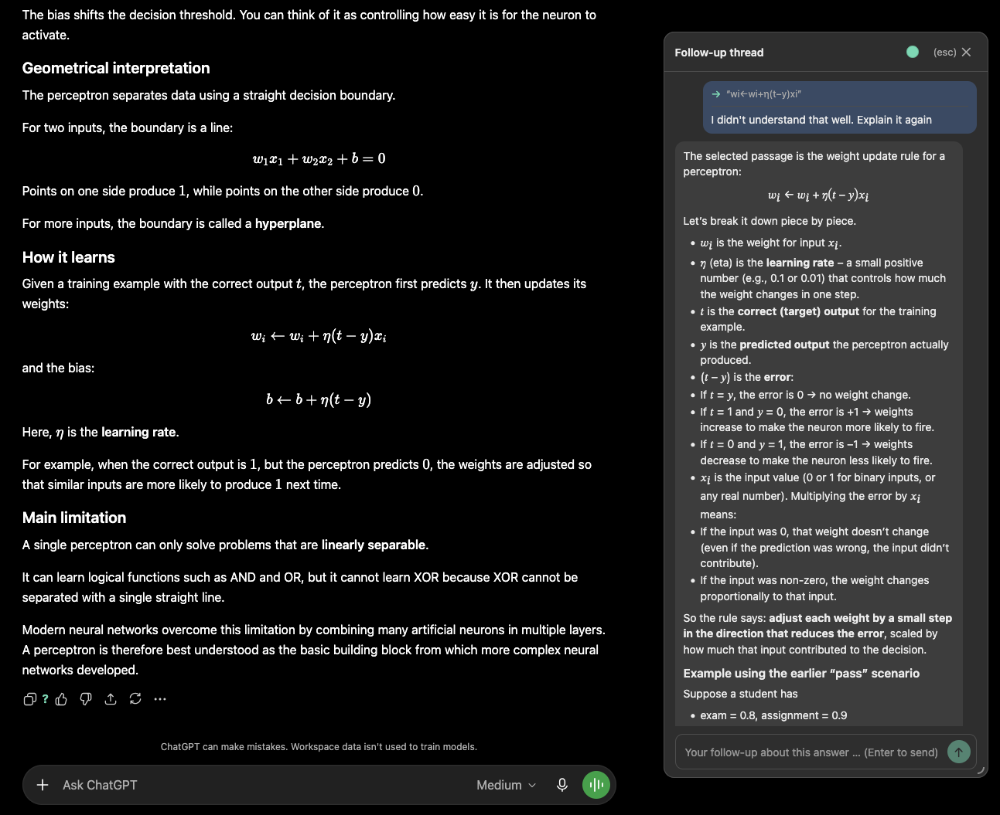
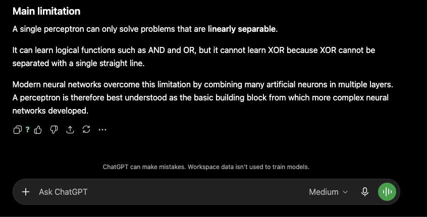
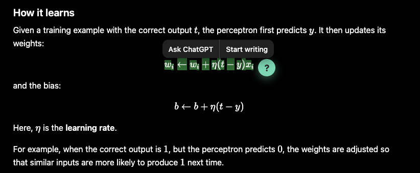
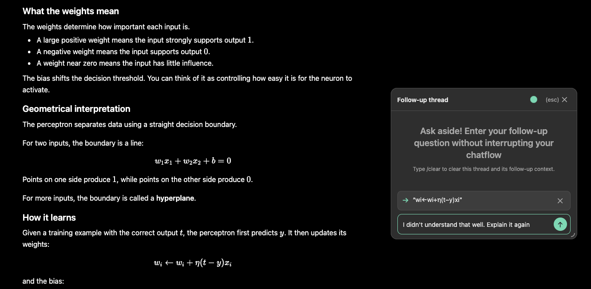
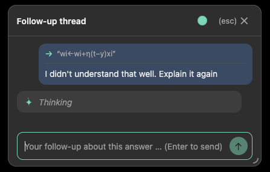
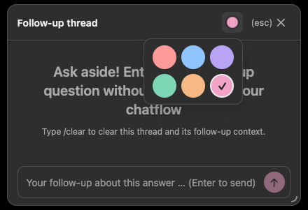

# AskAside

Ask follow-up questions about individual AI answers in **ChatGPT** and **Gemini**
as a separate thread in a side panel – without changing the linear main chat or
its scroll position.

Under each AI answer a **"?" button** appears in the action toolbar. Clicking it
opens a floating thread box next to the answer, where you can ask follow-up
questions with the main chat (up to and including that answer) as context. The
main chat is never modified and threads are not persisted. The thread box can be
dragged by its header and resized from any edge or from the bottom-right grip.

You can also select text inside an AI answer. A floating **"?" button** appears
at the selection and opens the thread with that passage shown above the input.
Removing the passage with its **"✕" button** keeps the thread open and changes
subsequent questions back to the whole anchored answer. When a focused question
is sent, its passage moves into a compact quoted header inside the user bubble.
While the thread remains open, selecting a passage in any AI answer immediately
updates the composer reference and makes that answer the thread's current anchor.
The color dot in the thread header opens a persistent six-color pastel accent
palette shared by future threads.

## See AskAside in action

  

<em>Dig deeper without losing your place in the main conversation.</em>

<table>
  <tr>
    <th width="50%">Ask about any answer</th>
    <th width="50%">Focus on an exact passage</th>
  </tr>
  <tr>
    <td></td>
    <td></td>
  </tr>
  <tr>
    <td align="center">Open a side thread straight from the answer toolbar.</td>
    <td align="center">Select text to ask about only what matters.</td>
  </tr>
</table>

### Keep the source in sight

  

<em>The referenced passage stays attached while you compose your follow-up.</em>

<table>
  <tr>
    <th width="50%">Follow the response</th>
    <th width="50%">Make it yours</th>
  </tr>
  <tr>
    <td></td>
    <td></td>
  </tr>
  <tr>
    <td align="center">Context and progress remain visible inside the thread.</td>
    <td align="center">Choose a pastel accent that persists across new threads.</td>
  </tr>
</table>

## Repository layout

| Folder | Description |
|---|---|
| [`ask-aside-chrome/`](ask-aside-chrome/) | Chrome / Chromium build (Manifest V3, `service_worker` background) |
| [`ask-aside-firefox/`](ask-aside-firefox/) | Firefox build (Manifest V3, `scripts` background + `browser_specific_settings`) |

Both builds keep equivalent implementations of `adapters.js`, `content.js`,
`background.js`, `env.js`, and `options.html/js`. They differ where browser APIs
or `manifest.json` fields require browser-specific integration. See each folder's
`README.md` for installation steps.

## Quick start

**Chrome** — open `chrome://extensions`, enable **Developer mode**, click
**"Load unpacked"** and select the `ask-aside-chrome/` folder.

**Firefox** — open `about:debugging#/runtime/this-firefox`, click
**"Load Temporary Add-on…"** and select `ask-aside-firefox/manifest.json`.

Then open the extension options (right-click the icon → "Options") and pick a
provider:

- **Anthropic** directly (`sk-ant-…`, from platform.claude.com), model fixed to
  `claude-opus-4-8`
- **OpenRouter** (`sk-or-…`, from openrouter.ai) with a freely chosen model ID
  from openrouter.ai/models (e.g. `anthropic/claude-sonnet-4.5`, `openai/gpt-4o`)

## Configuration via `.env` (optional)

Both builds can be configured without the options UI by placing a `.env` file in
the respective folder (copy `.env.example` → `.env`). It is bundled with the
extension and read at runtime; supported keys:

| Key | Maps to |
|---|---|
| `ASKASIDE_PROVIDER` | `anthropic` or `openrouter` |
| `ANTHROPIC_API_KEY` | Anthropic key (`sk-ant-…`) |
| `OPENROUTER_API_KEY` | OpenRouter key (`sk-or-…`) |
| `OPENROUTER_MODEL` | OpenRouter model ID |
| `OPENROUTER_BASE_URL` | OpenAI-compatible base URL (optional; see note below) |

`.env` values are **defaults**; anything saved through the options page overrides
them. `.env` is gitignored — only the `.env.example` templates are committed.

`OPENROUTER_BASE_URL` defaults to `https://openrouter.ai/api/v1`. Using a
different origin also requires adding that origin to `host_permissions` in the
build's `manifest.json` and reloading the extension.

## How it works

| File | Responsibility |
|---|---|
| `adapters.js` | Site adapters (selectors, conversation key) for ChatGPT and Gemini. New sites: add an object + a `manifest.json` match |
| `content.js` | Toolbar and selection "?" buttons, isolated shadow-DOM thread UI, keyboard-event shielding, drag/resize behavior, and the animated waiting indicator |
| `background.js` | API call in the background – either the Claude API directly (`claude-opus-4-8`) or OpenRouter (OpenAI-compatible endpoint, any model); keys are kept out of the page context and sent directly to the configured API |
| `options.html/js` | Provider selection, entry, and local storage of the API keys |
| `env.js` | Reads the optional bundled `.env` and merges it under the stored settings |

## Privacy

AskAside has no backend of its own. The selected chat context, your follow-up
thread, and your API key are sent only to the provider you configure in the
options. Threads live only in memory and are discarded when the panel closes;
legacy `threads:*` entries in extension-local storage are removed at the same
time. API keys and other saved settings remain stored locally.

## Known limitations

- The ChatGPT and Gemini adapters rely on each site's current DOM markup and may
  need updating if OpenAI or Google change their markup.
- Answers do not (yet) stream; they arrive as a whole.

## License

Licensed under the [MIT License](LICENSE). Copyright © 2026 Neo Ludolph.
